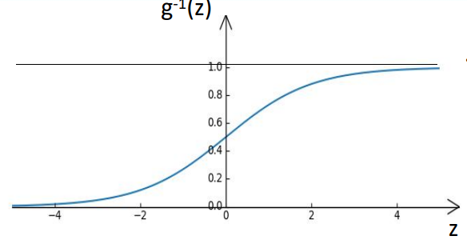
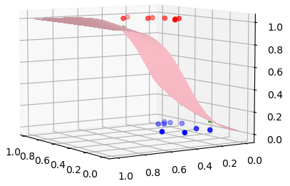

# Logistic Regression( Gradient Descent）


## Introduction:

​		Logistic Regression 虽然被称为回归，但是其本质上是一个分类模型，并常用于二分类。在其形式上，假定我们给定某一个数据集D，该数据集的标签只能是True或False。我们期望可以通过该数据集来学习到一个模型f(x)，使得当我们输入到样本的特征时，f(x)可以给出，在我们输入的特征的条件下，此事件发生的情况是True还是False。也就是当x<sub>i</sub>∈X<sub>1</sub>时f(x)=1, 其它情况下f(x)=0。


## Deduction:


#### 	Start：

​				如果给定一个特征向量 x=(x<sub>1</sub>,x<sub>2</sub>,...,x<sub>i</sub>)<sup>T</sup>，函数f(x)是关于特征向量x的一个映射，我们期望可以通过这个x-->f(x)的映射来判别含有该特征的样本输入哪一个类别，类别True或者是类别False。对比Liner Regression g(x)=W<sup>T</sup>X,它的输出是一个连续的值，但是对于分类问题来讲，我们需要他的输出是一个离散的值 
$$
f(x)=\begin{cases} 
		1, & Condition1\\ 
		0, & Condition2
\end{cases}
$$
但是分段函数是不连续的。我们无法对其求梯度，来进行参数的拟合。为此我们需要找到一个连续的光滑的函数来代替上文的分段函数，这个函数就是sigmoid函数。
$$
sigmoid(x)={1\over 1+e^-x}
$$


由此可以看出，Sigmoid函数可以将某一参数的值映射到（0，1）区间内，这样呢，我们就可以将Liner Regression的函数值进行Sigmoid的映射，将其定格在（0，1）区间内：
$$
g(y)=W^TX+b
$$

$$
y=g^-1(W^T+b)
$$

$$
令 z=W^T+b
$$

$$
f(x)=g^-1(W^T+b)=g^-1(z)
$$

$$
g^-1(z)={1\over 1+e^-z}
$$


这样，我们将得到一个关于w，b的光滑连续函数。这个便是Logistic Regression的基本方程。下面我们讨论代价函数cost的定义。

#### 	Cost：

###### 				Thinking One：

​							假设我们现在通过g<sup>-1</sup>得到了一个值P,P∈（0，1），那么我们就可以将这个P的值看作是对于样本关于标	签‘1’的概率。这样一来的话，因为标签只有0或1，因此他相对于0的概率就是（1-P）。显而易见的，这是一个伯努利分布，因此我们可以将某一个样本取0或者1的概率值写成这个样子
$$
P(y|w,b)=(1- \hat y)^{1-y}*\hat y^y
$$


当然了，既然这个函数的结果表示的是取0或者取1的概率值，所以我们期望他越大越好。那么当有多个样本时，计算它发生的概率值，我们就需要将某一个样本发生的概率值进行相乘，也就是
$$
P(x)=∏(1- \hat y)^{1-y}*\hat y^y
$$


但是，对于这种形式的函数，他的函数值都是小于1的，因此，在进行连乘的时候非常容易导致结果下溢。所以不妨我们对他们两边同时取对数，变换为这样的形式：
$$
log(P(x))=Σ（1-y）log（1- \hat y）+ylog(\hat y)
$$
这样我们就可以通过梯度下降的方法让log(p(x))越大越好，也就是通过估计W和B的值来让log(p(x))越大越好，因为从始至综我们的需要估计的参数也就是W和B。再者LOG函数是一个单调递增的函数。其值会与P（x）的值的变化方向一致，所以不妨我们将函数写成这个样子：
$$
L(W,B)=Σ（1-y）log（1- \hat y）+ylog(\hat y)
$$
对其进行求导得：
$$
{∂L(W,B)\over∂w_j}=Σ(y_i-f(x_i))x_{ij}
$$
因此可以得到我们对w，b进行参数更新的函数：
$$
W=w \underbrace{+}_\text{越大越好} αΣ(y_i-f(x_i))x_{ij}
$$


###### 				Thinking  Two：

​							既然我们要找到一组w,b的值来让我们预测的值更接近真实的标签，那么为什么我们不能将函数这样写?当标签为1时，预测值与真实值的距离为（1-P的预测值），当标签为0时，那么预测值与真实值的距离为P的预测值，这样公式改写为：
$$
P(y|w,b)=(1- \hat y)^y*\hat y^{1-y}
$$
然后我们就可以计算出每一个预测出来的概率值与真实标签的距离，就像Liner Regression那样将这些‘距离‘当作损失值来计算，进行梯度下降了，找到w,b。


#### 		End：

###### Data：


###### 		Analysis:




$$
Prediect=[1, 1, 1, 1, 1, 1, 0, 0, 0, 1, 0, 0, 0, 0, 1, 0, 0]
$$

$$
label=[1, 1, 1, 1, 1, 1, 1, 1, 0, 0, 0, 0, 0, 0, 0, 0, 0]
$$


<h4>分类结果混肴矩阵:</h4>   <!--标题-->
<table border="1" width="500px" cellspacing="10">
<tr>
  <th align="left">真实情况\预测结果</th>
  <th align="center">正例</th>
  <th align="right">反例</th>
</tr>
<tr>
  <td>正例</td>
  <td>TP=6</td>
  <td>FN=2</td>
</tr>
<tr>
  <td>反例</th>
  <td>FP=2</td>
  <td>TN=7</td>
</tr>
</table>


$$
Accuracy={(TP+TN)\over(TP+TN+FN+FP)}=0.7647058823529411
$$


$$
Precision={TP\over(TP+FP)}=0.75
$$

$$
Recall={TP\over(TP+FN)}=0.75
$$


###### 						Code

```python
import numpy as np
import matplotlib.pyplot as plt
import random
import math
#初始化随机数种子
random.seed(10)
#----------------------------------数据定义与处理-------------------------------------------------#
learningRate=0.2 #初始化学习率
weight_one=random.randint(0,1) #为第一个权重赋值
weight_two=random.randint(0,1) #为第二个权重赋值
bais=random.randint(1,10) #为bais赋值

source_data_file=open(r'西瓜数据集3.0α.csv') #打开数据集文件
Data=source_data_file.read() #将文件数据读取到Data中
Data=Data.split('\n')
Data=Data[1:len(Data)-1]

#数据集中的每一个样本有2个特征
_x,_y=[],[]

for i in Data:
    _x_middle=[]
    _x_middle.append(float(i.split(',')[1]))    #将第一个特征加入
    _x_middle.append(float(i.split(',')[2]))    #将第二个特征加入
    _x_middle.append(1)                         ##进行矩阵运算：将_x_train,_x_test的维度拓展‘1’，添加一个值为‘1’的特征，方便进行bais的运算
    _x.append(_x_middle)
    if i.split(',')[3]=='是':                    #将分类的情况转换为 0和1 并将其放在y中
        _y.append(1)
    else:
        _y.append(0)
#_x=[[0.697, 0.46, 1], [0.774, 0.376, 1], [0.634, 0.264, 1], [0.608, 0.318, 1], [0.556, 0.215, 1], [0.403, 0.237, 1], [0.481, 0.149, 1], [0.437, 0.211, 1], [0.666, 0.091, 1], [0.243, 0.267, 1], [0.245, 0.057, 1], [0.343, 0.099, 1], [0.639, 0.161, 1], [0.657, 0.198, 1], [0.36, 0.37, 1], [0.593, 0.042, 1], [0.719, 0.103, 1]]
#_y=[1, 1, 1, 1, 1, 1, 1, 1, 0, 0, 0, 0, 0, 0, 0, 0, 0]

#随机抽取测试集与训练集并将数据转换为矩阵
Index_test=[]
for i in range(int(len(_x)*0.2)):
    Index_test.append(_x.index(random.sample(_x,1)[0]))  #将随机选取出来的索引返回到Index_test中
Index_test=list(set(Index_test))  #为了避免索引重复，将它转换为集合后再转换为列表
#Index_test=[8, 11, 15]

# 提取出训练集的索引------
# 先将所有的索引都赋值给Index_train
# 再删除Index_Train中的Index_test的值

Index_train=list(range(len(_x)))    #Index_train=[0, 1, 2, 3, 4, 5, 6, 7, 8, 9, 10, 11, 12, 13, 14, 15, 16]
for i in Index_test:
    Index_train.remove(i)         #去除训练集中的Index后 Index_Train=[0, 1, 2, 3, 4, 5, 6, 7, 9, 10, 12, 13, 14, 16]

### 创建四个列表 用来分别存放 训练集x 训练集y 测试集x 测试集y
_x_test=[]      ###---------------------测试集x----------------###
_x_train=[]     ###---------------------训练集x----------------###
_y_test=[]      ###---------------------测试集y----------------###
_y_train=[]     ###---------------------训练集y----------------###
for i in range(len(_x)):
    if i in Index_test:
        _x_test.append(_x[i])
        _y_test.append(_y[i])
    else:
        _x_train.append(_x[i])
        _y_train.append(_y[i])

#_x_train=[[0.697, 0.46, 1], [0.774, 0.376, 1], [0.634, 0.264, 1], [0.608, 0.318, 1], [0.556, 0.215, 1], [0.403, 0.237, 1], [0.481, 0.149, 1], [0.437, 0.211, 1], [0.243, 0.267, 1], [0.245, 0.057, 1], [0.639, 0.161, 1], [0.657, 0.198, 1], [0.36, 0.37, 1], [0.719, 0.103, 1]]
#_x_test=[[0.437, 0.211, 1], [0.245, 0.057, 1], [0.593, 0.042, 1]]
#_y_train=[1, 1, 1, 1, 1, 1, 1, 1, 0, 0, 0, 0, 0, 0]
#_y_test=[1, 0, 0]


_weight_bais=np.mat([[weight_one],[weight_two],[bais]]) #创建参数列向量

# 将参数转换为矩阵
_x_train=np.mat(_x_train)
_x_test=np.mat(_x_test)
_y_train=np.mat(_y_train)
_y_test=np.mat(_y_test)


#--------------------------------------------定义sigmoid函数的计算方法------------------------------------------------#
def sigmoid(x):
    # 直接返回sigmoid函数
    return 1. / (1. + np.exp(-x))

epoch=300  #定义迭代的次数

#-------------------------------------------开始迭代求解------------------------------------------------------------#

#----------------------------P(y|PrediectY)=(PrediectY**y)*((1-PrediectY)**(1-y))-------------------------------#
#----------------------------P=∏(PrediectY**y)*((1-PrediectY)**(1-y))-------------------------------------------#
#----------------------------log（p）=Σy*log(PrediectY)+(1-y)*log(PrediectY)-------------------------------------#
#----------------------------L(w,b)=Σy*log(PrediectY)+(1-y)*log(PrediectY)--------------------------------------#
#----log 函数是一个单调递增的函数 我们希望 log（P）的值越大越好 ，因为再y=0/1确定的情况下，我们希望他为0 或者 1 的概率越大越好-----#
#----------------------------因此我们期望 L(w,b)越大越好------------------------------------------------------------#
#----------------------------对L（w,b）求导-------> w=w+learningrate*（L的导数）------------------------------------#

PrediectY=sigmoid(np.dot(np.array(_x_train),np.array(_weight_bais)))   #(14,1)
#_y_train  (1,14)
#_x_train  (14,3)
#_weight_bais (3,1)


for i in range(epoch):
    PrediectY=sigmoid(np.dot(np.array(_x_train),np.array(_weight_bais)))   #PrediectY=sigmoid(W.T*X)
    _weight_bais=_weight_bais+learningRate*_x_train.T*(_y_train.T-PrediectY)  #进行参数的更新迭代


################################利用迭代好的参数进行性能度量##########################################
Prediect=sigmoid(np.dot(np.array(_x),np.array(_weight_bais)))  #将参数送入模型得到返回值
Prediect[Prediect>=0.5]=1   #将概率值大于0.5的定义为预测结果1
Prediect[Prediect<0.5]=0    #将概率值小于0.5的定义为预测结果0
Prediect=list(map(int,list(Prediect.T[0]))) #转换数据类型，方便观察

#Prediect=[1, 1, 1, 1, 1, 1, 0, 0, 0, 1, 0, 0, 0, 0, 1, 0, 0]
#label=[1, 1, 1, 1, 1, 1, 1, 1, 0, 0, 0, 0, 0, 0, 0, 0, 0]
label,TP,FN,FP,TN=_y,0,0,0,0
for i in range(len(Prediect)):
    if label[i]==1:
        if Prediect[i]==1:
            TP=TP+1                  #计算TP的值
        else:
            FN=FN+1                  #计算FN的值
    else:
        if Prediect[i]==0:
            TN=TN+1                  #计算TN的值
        else:
            FP=FP+1                  #计算FP的值
accuracy=(TP+TN)/(TP+TN+FN+FP)       #计算准确率
Precision=TP/(TP+FP)                 #计算查准率
Recall=TP/(TP+FN)                    #计算查全率

print("accuracy={} Precision={} Recall={}".format(accuracy,Precision,Recall))
# accuracy=0.7647058823529411 Precision=0.75 Recall=0.75

#---------------------------------------画图------------------------------------################
fig=plt.figure()
ax =plt.axes(projection='3d')
# 三维线的数据
#---------------------------------画标签为一的图----------------------------------################
zline = np.array(_y[0:8])
xline = np.array(_x[0:8])[::,0]
yline = np.array(_x[0:8])[::,1]
ax.scatter3D(xline, yline, zline,  edgecolors='Red',facecolor='Red',label='True Data')
#---------------------------------画标签为零的图----------------------------------#################
zline = np.array(_y[8:17])
xline = np.array(_x[8:17])[::,0]
yline = np.array(_x[8:17])[::,1]
ax.scatter3D(xline, yline, zline,  edgecolors='Blue',facecolor='Blue',label='False Data')
#---------------------------------画拟合出来的曲面----------------------------------################
x=np.array(_x)[::,0]
y=np.array(_x)[::,1]
z=np.array(sigmoid(np.mat(_x)*_weight_bais))
ax.scatter3D(xs=x, ys=y, zs=z,  marker="*",color='green',label='Prediect')
x = np.arange(0, 1, 0.01)
y = np.arange(0, 1, 0.01)
X, Y = np.meshgrid(x, y)
def Z(X, Y):
    return sigmoid(X*float(_weight_bais[0]) + Y*float(_weight_bais[1]) + float(_weight_bais[2]))
ax.plot_surface(X=X, Y=Y, Z=Z(X, Y),rstride=5, cstride=5, antialiased=False,color='pink')

plt.show()

#--------------------------------结束-------------------------------------------###################
```


